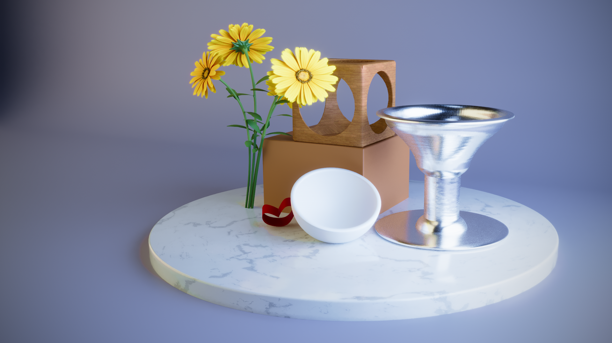
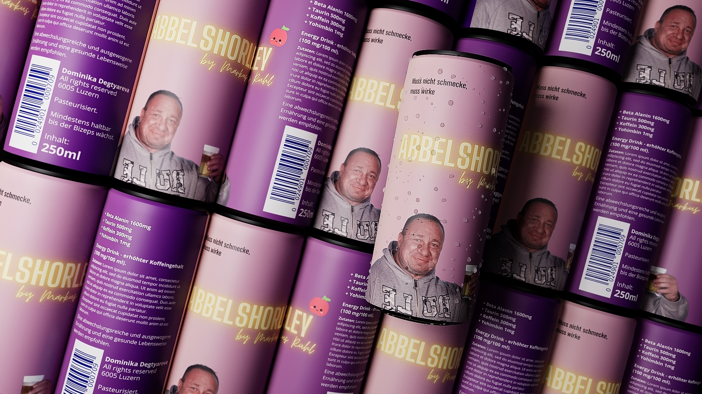
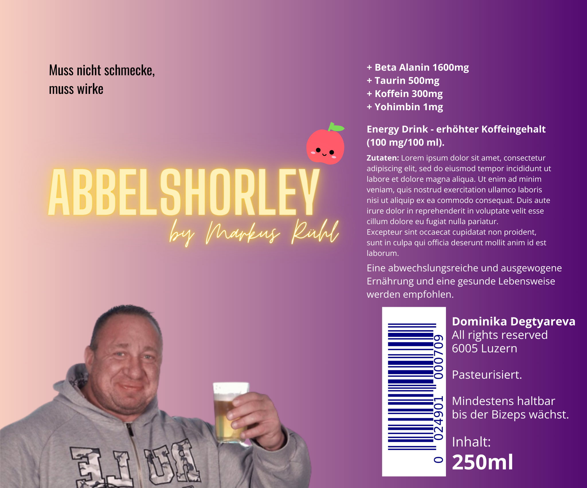
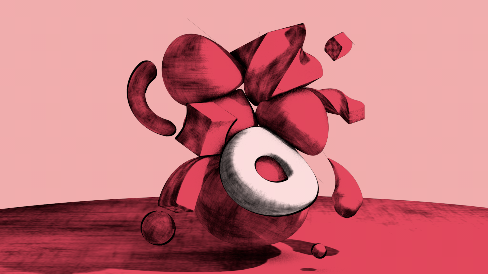

# 4DAUT (4D Authoring)
This folder contains all the assets from the 4DAUT module.

The module was about the basics of 3D modelling and animation with Cinema 4D. We learned the interface, tools and techniques of the software through a series of lessons and exercises. The final project was to create a short animation using the skills we acquired during the course.

## Content
### My own renders

### Final group project - an animated short film
[Spacetrain](./SpaceTrain.mp4)

Team:
- Dominika Degtyareva
- Lisa Landolt 
- Sawmiya Stanin