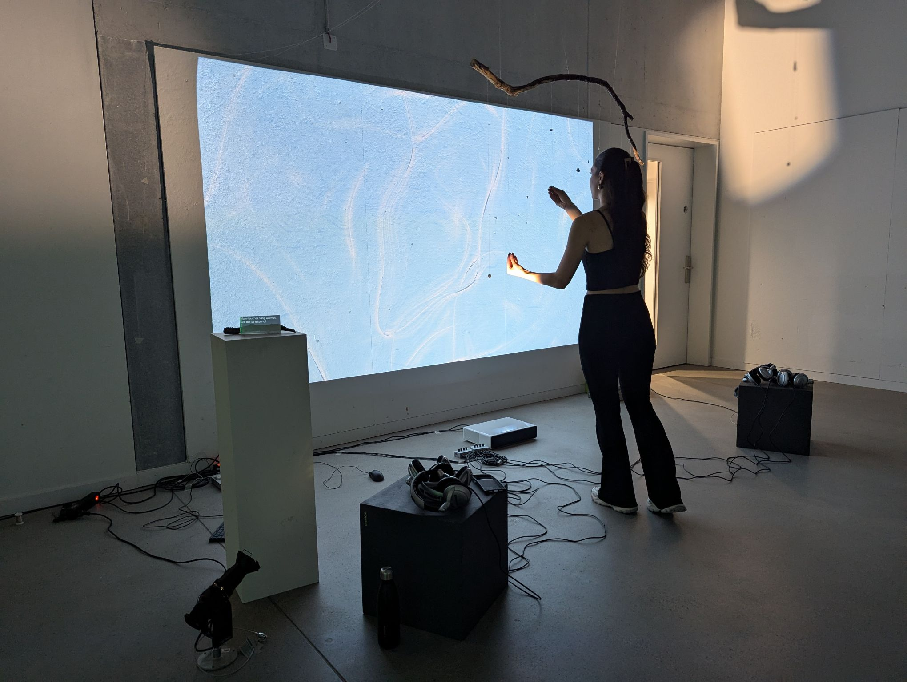
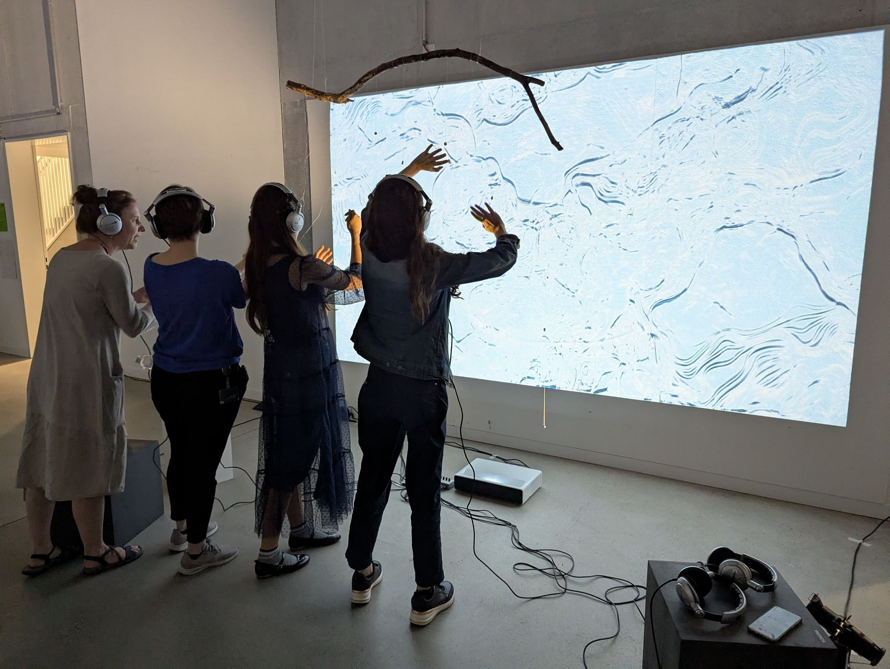
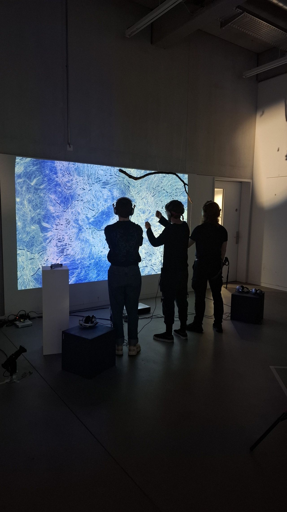

# CO_128 (Crafting interactive narratives for art & design)
This folder contains all the assets from the Colabor module. It's a module that emphasized on collaborating with other students of the art and design departments by learning from each other. The topic of the year was "exhaustion".

## Content
- [Learning touchdesigner](#learning-touchdesigner)
- [Project Icebreaker](#project-icebreaker)

## Learning touchdesigner
The videos are compressed due to github restriction.
* Water Wave Effect:
https://github.com/user-attachments/assets/e02ee81e-c543-4242-808a-fe808f137af2

* Retro Landscape:
https://github.com/user-attachments/assets/ee825682-e13e-4027-ba61-755717784be6

* Particle Butterfly:
https://github.com/user-attachments/assets/bd0435cc-8877-46bb-afd8-373a6b26e81c

## Project Icebreaker
* `What is it about? -` On display are several conductive threads hanging from a branch. They react to touch and change the visuals. The more people take part, the more the ice ‘breaks’ and begins to thaw until it unfolds completely. The whole thing is intended to invite people to work together to counteract exhaustion - through active participation and mutual care.

* You can find the documentation of the project setup [here.](https://janschwegler.github.io/di-CO_128/)

