# DIPRO (Digital Project: Supercluster !Daten (Spiel) & Zeit)
This folder contains all assets from the DIPRO module. It is an artistic research project where I explore my relationship with mathematics and the way I'm thinking through various fragments.

## Content
- [Project "Ce n'est pas des maths."](##project-"ce-n'est-pas-des-maths.")
- [Weekly Sprint Logs](#weekly-sprint-logs)
    - [Week 1](#week-1)
    - [Week 2](#week-2)
    - [Week 3](#week-3)
    - [Week 4](#week-4)
    - [Week 5](#week-5)
    - [Week 6](#week-6)
    

## Project "Ce n'est pas des maths."
* [Process Documentation (Miro Board)](https://miro.com/app/board/uXjVJGySQIA=/?share_link_id=773862506291)
* [Inspiration: Module "Beautiful Mathematics"]()

 `Why the title? -` Französisch ist auch eine Sprache, die nicht sonderlich in Beliebtheit badet. So verhält es sich mit Mathematik auch.

"Ceci n'est pas des maths." ist eine Anspielung auf René Magrittes berühmtes Gemälde "Ceci n'est pas une pipe" (Dies ist keine Pfeife). Das Gemälde zeigt ein Bild einer Pfeife mit der Unterschrift darunter, dass es sich nicht um eine echte Pfeife handelt, sondern nur um eine Darstellung davon. Ähnlich möchte ich mit meinem Projekt darauf anspielen, dass es sich hier nicht um die Mathematik selbst handelt, sondern eine künstlerische Interpretation davon.

 `What is it about? -` Zu Beginn wollte ich einen Weg finden, Mathematik und logisches Denken für mich erfahrbar zu machen. Als Person, die während der Schulzeit mit Mathe sehr zu kämpfen hatte, war mein Zugang zu mathematischen Lösungsverfahren oft blockiert, gleichzeitig aber hat mich das ästhetische und emotionale Potenzial von Mustern, Gleichungen und Strukturen fasziniert. Ich wollte Mathematik nicht lösen, sondern erleben mit den Inhalten, die ich im Studium gelernt habe oder die mich sonst faszinierten. 

Mich interessierte, wie sich mathematische Prinzipien – z.B. Rekursion, Chaos oder Ordnung – in visuelle, organische Formen übersetzen lassen, die ich als "organische Person" auch verstehe. So entstand die Idee, Fragmente zu schaffen: kleine, lebendige Experimente, die meine Denkweise und Wahrnehmung widerspiegeln, ohne auf ein konkretes Endprodukt abzuzielen.

## Weekly Sprint Logs
### Week 1
#### Sprint-Review
`Ergebnisse der Woche:` Ich habe viele Gespräche mit Dozenten, Kommilitonen und ChatGPT geführt und über meine Vorstellungen, Ideen und Ängste geredet. Für mich habe ich das Briefing finalisiert und die Bereiche der Mathematik abgesteckt, die mich interessieren. Nicht zuletzt habe ich den Sprintlog aufgesetzt und ein Kanbanboard mit den ersten Tasks erstellt. Mein Moodboard wächst auch und meine Vision wird klarer für mich.

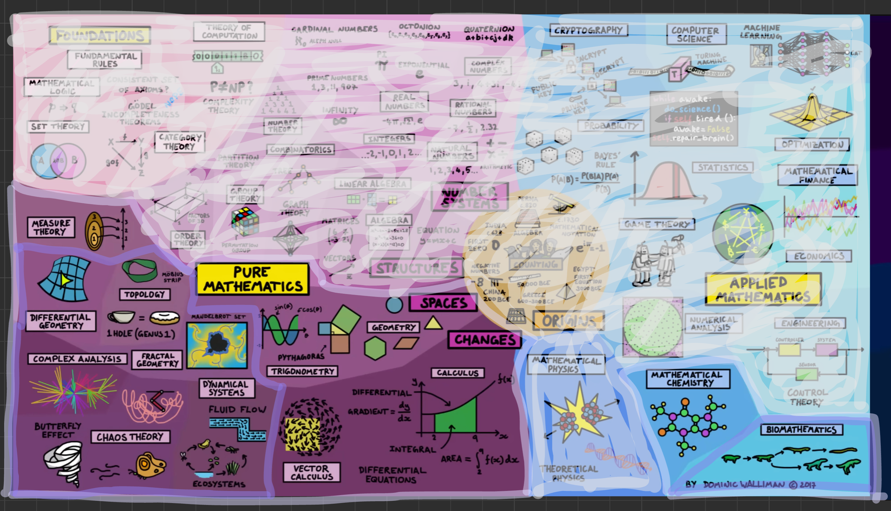
Habe die Karte gefunden. Sehr hilfreich um die Bereiche der Mathematik zu verstehen und mir klar zu werden, was mich interessiert.

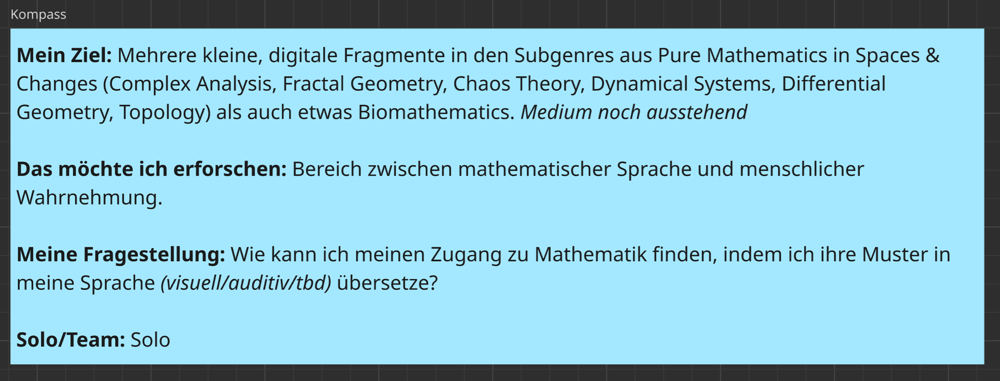
Mein persönliches Briefing und Kompass für die nächsten Wochen.

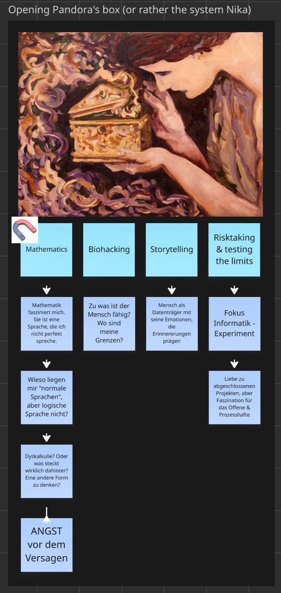
Bereits zusammengestellt aus etlichen weiteren Post-its.

#### Retrospektive
`Was lief gut:` Mit ChatGPT reden und brainstormen. Weil mir fehlen die Möglichkeiten, die ich für die Umsetzung brauche. Ich kenne soweit nur p5js, 3js und Touchdesigner.

`Was lief nicht gut:` Ich habe leider immernoch kein Medium in dem ich meine Fragmente sammeln möchte, weil mir alles nicht immersiv genug ist.

`Was muss sich ändern:` Ich muss mir asap um das Medium Gedanken machen, mehr Gedanken einholen. Auch die Tasks anfangen konkreten Zielen zuzuorden. Was will ich den Dozenten belegen?

`Was soll so bleiben:` Mein Spirit, meine Motivation.

#### Besprechung
Ich muss mich nächste Woche noch auf den Weg machen einen Besprechungspartner zu finden. Das ist etwas schwierig diese Woche mit der Popcon (Jenny und Remo sind weg) als auch Freitagabend....

#### Planung Sprint 2
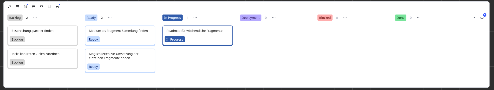

---
### Week 2
#### Sprint-Review
`Ergebnisse der Woche:` Miro Board organsiert, Task Overview korrigiert nach PROJ, Fragmente Sammlungsfass angefangen zu recherchieren. (Twine? AR? Digital Book?) Roadmap erstellt, die ist aber noch nicht fix. Subthemen definiert, aber die können sich je nach Interessen und Ausrichtung noch anpassen. Habe mir jetzt einmal ein Zeitframe von 2 Wochen pro Fragment gegeben, aber vielleicht ist das auch zu viel?

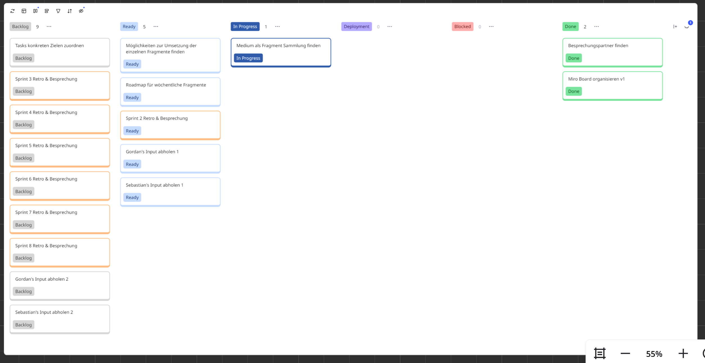
Momentaner Stand des Kanban Boards.

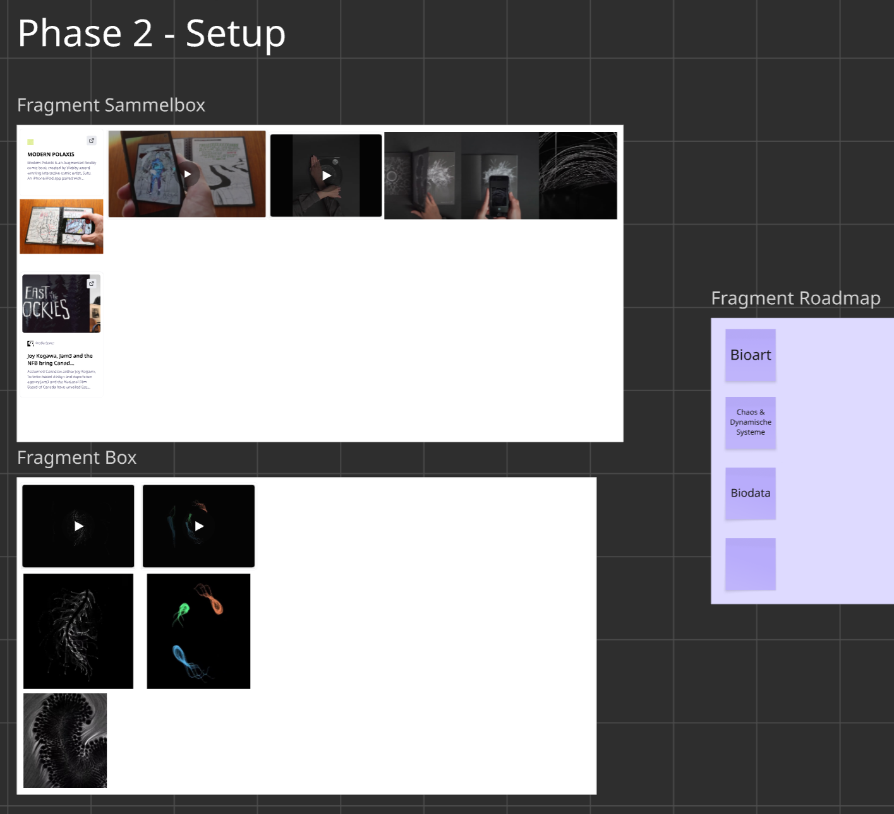
Fragmente und Fragmente Sammelbox als auch Roadmap.

#### Retrospektive
`Was lief gut:` Mein Miro Board füllt sich und ich habe jetzt auch etwas mehr einen Plan, weil ich einige Beispiele gefunden habe, an denen ich mich orientieren kann.

`Was lief nicht gut:` Leider etwas Startschwierigkeiten und ein Motivationsloch, weil ich mich nicht ins Konzept denken konnte und deshalb erst gar nicht angefangen habe und die Arbeit vor mich hergeschoben habe. Auch musste ich mich um das Mentorat kümmern, was gebrennt hat und war mit den Gedanken auch eher beim Storytelling Modul. Ich bin auch sehr lost welche Medien mir offen stehen für die Umsetzung und ich habe auch immernoch keinen Plan, ob das weder was Halbes noch was Ganzes wird. Das Projekt ist dann wie so ein Mülleimer mit ungetrenntem Abfall.

`Was muss sich ändern:` Ich muss anfangen in die Fragmente gehen und definieren, was dort der Output für mich ist und einfach mal etwas in die Tastatur greifen. Gespräche mit den anderen Dozenten suchen und fragen, welche Medien sie sich für die Umsetzung vorstellen könnten.

`Was soll so bleiben:` Die Ideen, auch wenns ein Flickenteppich ist. Dranbleiben!

#### Besprechung
*By Jennifer*

`Ergebnisse:` Persönlich mag ich Mathe ganz und gar nicht. Aus diesem Grund finde ich es umso beeindruckender, dass du ein Projekt rund um das Thema Mathe erstellen möchtest. Als jemand, der auch ein grosser Fan von Storytelling ist, kann ich mir gut vorstellen, dass das Projekt es schaffen kann Personen wie mir, die durch Schulischen Stress eine Abneigung gegen Mathematik entwickelt haben einen neuen, besseren Blickwinkel auf das Thema zu geben.Ich mag,  dass du das Projekt interaktiv gestalten möchtest und bin gespannt zu sehen für welches Medium du dich entscheiden wirst!

`Retrospektive:` Ich finde es gut, dass du dir die Meinung verschiedener Dozenten einholen willst und denke persönlich, dass Susanne noch von grosser Hilfe sein könnte. Ich habe schon auf deinem Miro Board gesehen, dass sie euch im Storytelling Modul über den AR-Comic erzählt hat.Eine Überlegung wäre es vielleicht auch das Storytelling Modul mit Dipro zu verbinden?

*By Yanis*

Ich finde es toll, dass du ein Journal führst, aber da wir nicht so viel Zeit haben, empfehle ich dir, dich vorerst auf eine Sache zu konzentrieren. Probier es einfach mal aus, es sei denn, du bist dir schon sicher dass du zeitlich drin bist, dann würde ich mich an den Plan halten. Wir haben dieses Thema bereits besprochen und ich finde es großartig. Ich bin gespannt, was dabei herauskommt.

#### Planung Sprint 3
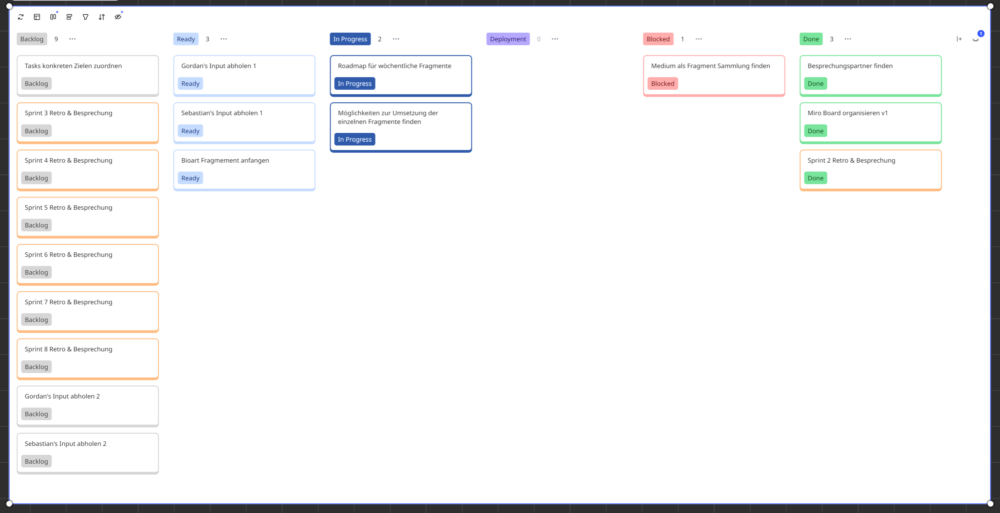

---
### Week 3
#### Sprint-Review
`Ergebnisse der Woche:` Checkin mit Dragica, erneutes Abstecken der Arbeit. Entschlossen, dass ich mich nicht auf die Fragment Sammelbox fokussieren möchte sondern einfach irgendwo anfange sollte mit dem, was ich schon kenne (aus Beautiful Mathemathics) mit der Technik, die ich bereits kenne und daraus die Parameter tweake und neue Wege suche. Bin noch über mathematische Visualisationen zu Markov Chains, Analysis und Algorithmen gestolpert. Habe meine Rasperry Pi Kit gefunden und noch etwas recherchiert, ob ich eine Fragment Sammelbox daraus machen könnte, aber habe nicht zu viel Zeit darin investiert. Habe mein Touchdesigner aktualisiert, das "Getting started with Python"-Tutorial durchgemacht als auch p5js eingerichtet und mich wieder mit den Basics etwas auseinandergesetzt. Hab meine alten Matbf projects hervorgeholt und etwas studiert.

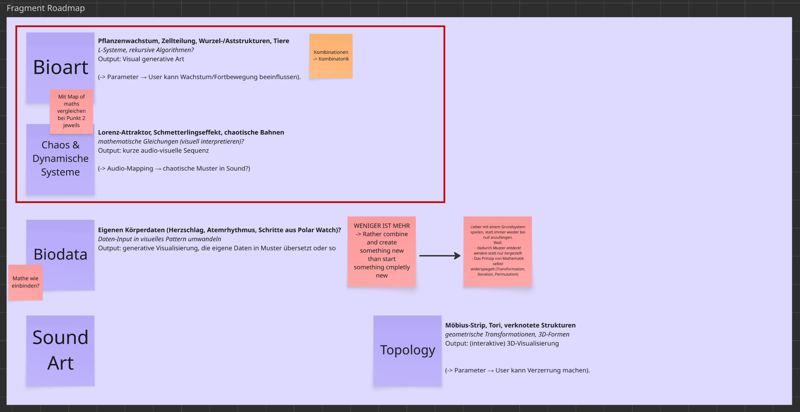
Fragment Roadmap mit Gedanken ud Fokuspunkten.

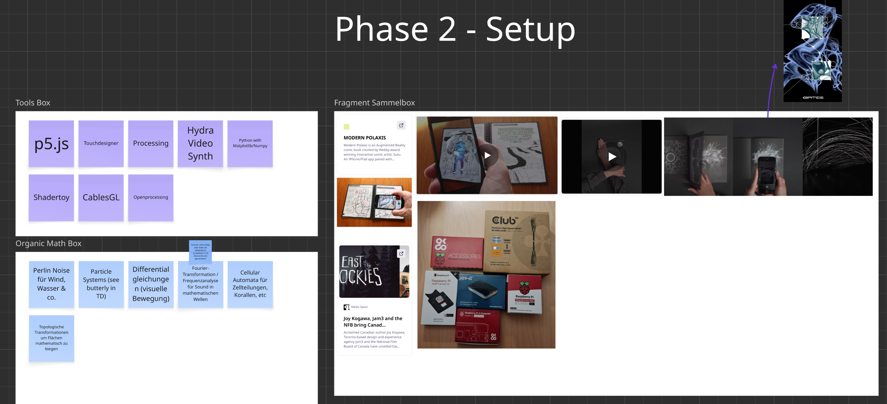
Neu dazugekommen ist die Mathbox und die Toollbox.

#### Retrospektive
`Was lief gut:` Das Gespräch mit Dragica hat mir geholfen. Ich komme voran und bin endlich "in der Tastatur", meine Umgebungen sind ready. Ich fühle mich nicht mehr lost. Es ist ein artistic research als auch Kennenlernen meiner Denkweise und Arbeitsweise. Das nimmt mir den Druck mich mit Anderen zu vergleichen, die ein fixes Goal haben.

`Was lief nicht gut:` Ich habe immernoch kein Fragment, obwohl ich bis Ende Woche mal etwas haben wollte.

`Was muss sich ändern:` Ich muss weniger denken und mehr erstellen!

`Was soll so bleiben:` Eine explorative Arbeit, kein Produktdenken. Auch der Arbeitsprozess ist Teil der Exploration - wie denke ich, wie arbeite ich?

#### Besprechung
*By Jennifer*

`Ergebnisse:` Das Mindset "don't think, just do it", das du diese Woche ergattern konntest ist finde ich die beste Strategie, die es gibt. Du hast diese Woche sehr viel organisiert und recherchiert und ich hoffe, dass dir das und dein neu gefundenes Mindset dabei helfen können, in den kommenden Tagen viel Gutes zu lernen und zu kreieren!

`Retrospektive:` Gute Retrospektive, mit erreichbaren Zielen. Sehr schön!

#### Planung Sprint 4
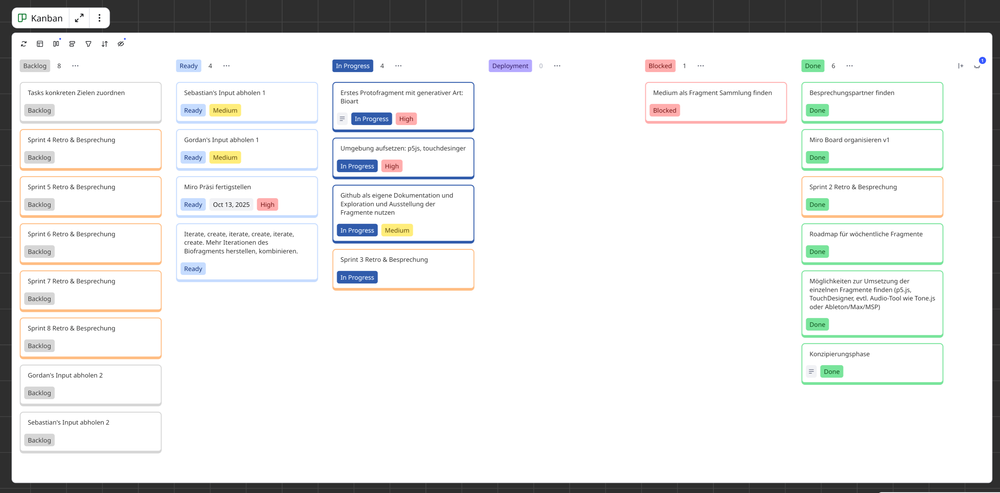

---
### Week 4
#### Sprint-Review
`Ergebnisse der Woche:` Mein Protofragment - ein einfaches L-System - um wieder den Einstieg zu finden, steht. Für mich ist es aber schwierig von 0 anzufangen, weil ich nicht **genau** weiss was ich am Ende möchte. Es ist für mich einfacher bereits mit dem weiter zu arbeiten, was man hat und das weiterentwickeln. Nur meine Gedanken. 

Diese Woche habe ich noch endlich die Inputs von Gordan und Sebastian abgeholt. Ich habe mir Notizen gemacht und muss meine Gedanken nochmals neu sortieren, gerade im Hinblick der Vorstellung das Projekt weiter in den Bachelor zu ziehen. Ich muss für mich meine Kernfrage konkretisieren und abstecken, was ich genau versuche herauszufinden. **Wann habe ich für mich "den Zugang gefunden"?**

Ich merke, dass mich zurzeit "Generative Art" mehr abholen kann als "Mathematical Art", weil ich dazu einfach bereits  durch AD einen Zugang habe

Ich habe zwischendurch auch noch weiterhin Research gemacht und ein paar Bücher und Webseiten vermerkt als auch mein Miro um ein "Generative Methods Box" ergänzt. Ich denke, ich werde den Research auch bündeln müssen in meiner Fragmentsammelbox.

Ach und ich bin zurzeit an meinem nächsten Fragment: eine Kombi aus dem Collatz Problem (das ja Ordnung hat mit seiner Zahlenfolge) mit etwas Chaos Gleichung (bringt Unordnung rein) und dann habe ich das Ganze noch in das Polarkoordinatensystem abgebildet, damit nicht nur ein chaotischer Haarballen entsteht. Im nächsten Schritt möchte ich das fertigstellen und dann mein L-System nehmen und weiterkombinieren und schauen, was ich daraus machen kann.

Erste Ansätze der Collatz Gleichung mit Chaos Theorie.

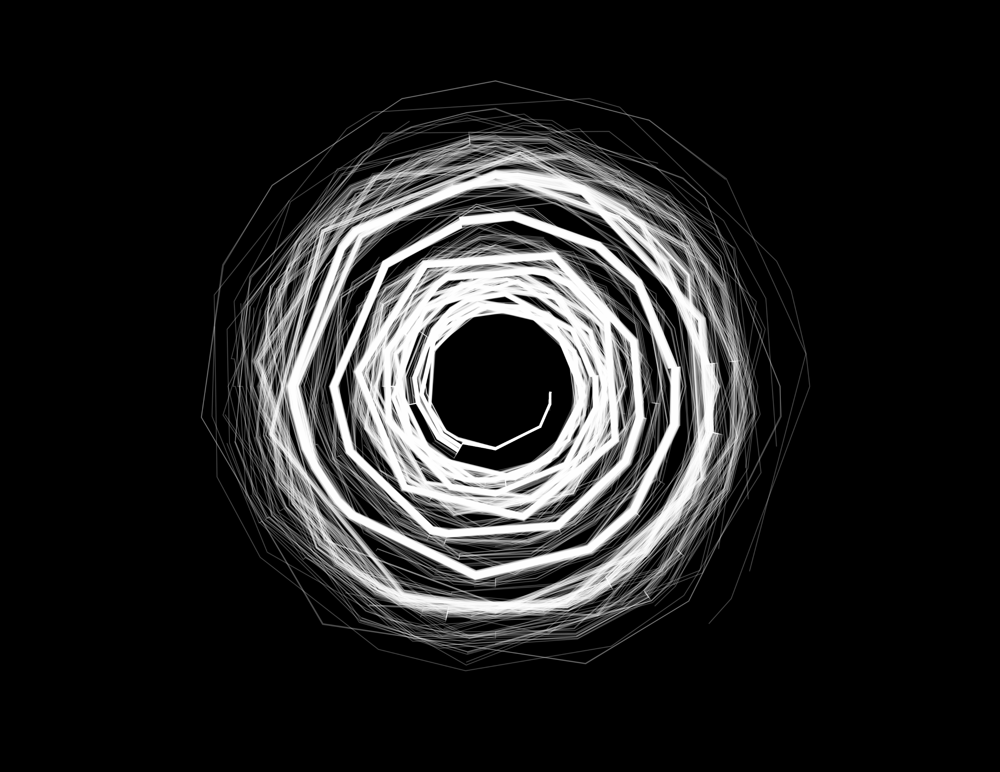
Collatz x Chaos x Trigonometrie im Polarkoordinatensystem.

#### Retrospektive
`Was lief gut:` Meine Präsentation. Ich habe meine Vision irgendwie rüberbringen können und auch einiger meiner Klasse abholen können. Es freut mich, wenn ich Leute dafür begeistern kann!

`Was lief nicht gut:` Das Gespräch mit Gordan. Ich glaube, für ihn ist das Projekt zu abstrakt. Er hat mich auf einen spezifischen Output gepusht, den ich für eine spezifische Menschengruppe machen sollte.

`Was muss sich ändern:` Muss langsam die Sammelbox aufbauen, weil ich kann nicht einfach mein Miro abgeben. Ich sollte meinen Research büscheln und meine Erkenntnisse.

`Was soll so bleiben:` Ich will noch mehr Fragmente machen und  mich ehrlich gesagt weniger darum kümmern ständig allen zu erklären, was ich genau mache und das zugänglich für alle Dozierenden zu machen.

#### Besprechung
Diese Woche haben wir uns entschieden, die Besprechungen wegzulassen.

#### Planung Sprint 5
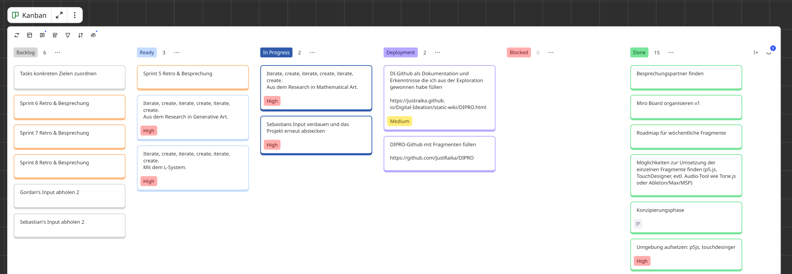

---
### Week 5
#### Sprint-Review
`Ergebnisse der Woche:` Keypoints aus den Inputs von Gordan und Sebastian herausgeschrieben im Hinblick auf DIPRO und auch eine mögliche zukünftge BA. Reflektions-Call mit Chris durchgeführt. Fragmentsammelbox auf Github angefangen aufzubauen, mit Node.js auseinandergesetzt, versuche zurzeit ein Projekt umzubauen, sodass ich meine eigenen Fragmente reinmachen kann und nicht von 0 aufbauen muss. Es funkioniert aber nicht. Und es macht mich wahnsinnig. Es macht mich echt wütend. Nicht einmal Copilot oder ChatGPT helfen sinnvoll.

#### Retrospektive
`Was lief gut:` Ich habe meine Adminsachen erledigt. Fühlt sich gut an.

`Was lief nicht gut:` Ich hatte diese Woche wieder nur damit verbracht das Projekt abzustecken und alles rundherum machen anstatt die Fragmente selber.

`Was muss sich ändern:` Ich lasse das mit der Fragmentsammelbox am Besten sein und konzentriere mich die Github Page zum Modul auf Vordermann zu bringen. Ich muss auch noch die anderen Beiden Fragmente fertigstellen.

`Was soll so bleiben:` Ich gebe mir Mühe und ich gebe mein Bestes. 

#### Besprechung
Weggefallen, weil ich von Donnerstag bis Sonntag in Lenzburg gearbeitet habe.

#### Planung Sprint 6
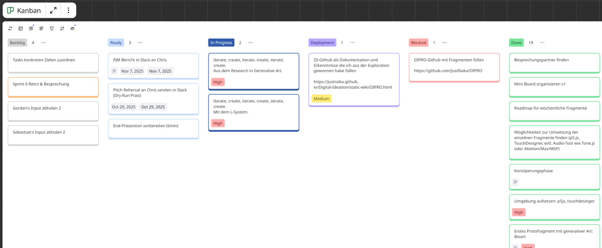

---
### Week 6