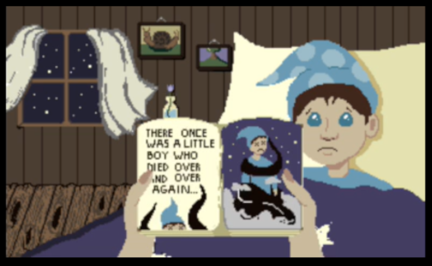
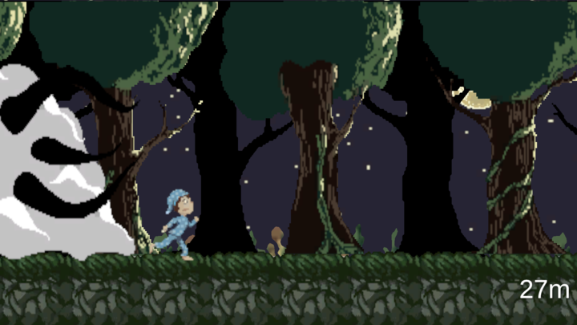
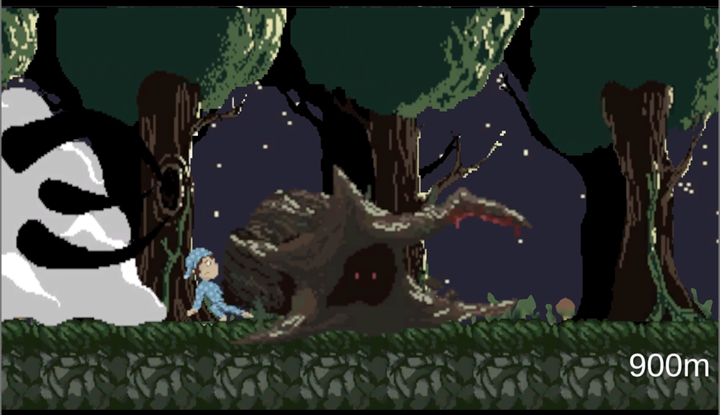
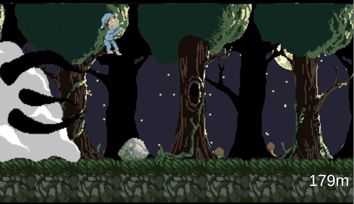
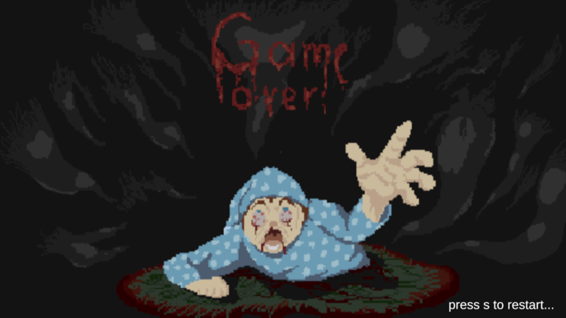

# IGAME (Game Design & Engineering)
This folder contains all the assets from the IGAME module.

## Content
- [Description of the bedtime story](#description-of-the-bedtime-story)
- [Team](#team)
- [Game](#game)

## Description of the bedtime story
* `What is it? -` Bedtime Story is a small horror-endless runner that we, a team of two developers and two designers, made in our first bachelor semester in about two weeks. You control a little boy who is caught up in his nightmare, running from a monster. Avoid the obstacles! Jump over stones with "w" and slide under treetrunks with "s". How far can you get?

We had to make the game in unity and the controls were limited to two keys on the keyboard (w and s in our case).

## Team
- Dominika Degtyareva - Game Development & Debugging
- Lisa Landolt - Game Development & Sound Design
- Annina Pfister - Game Design & Project Management
- Caterina Pollaci - Game Design & Art

## Game
* [Demo](https://celestial-insomniac.itch.io/bedtime-story)
* [Gameplay video](./Gameplay-Video.mp4)

<video src="./Gameplay-Video.mp4" controls width="600">
    Your browser does not support the video tag.
</video>

