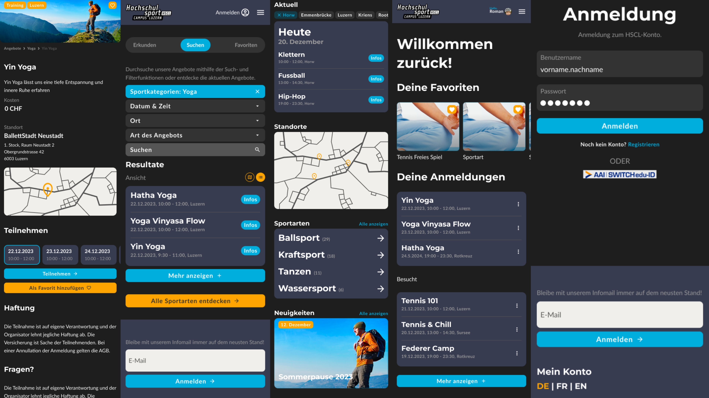
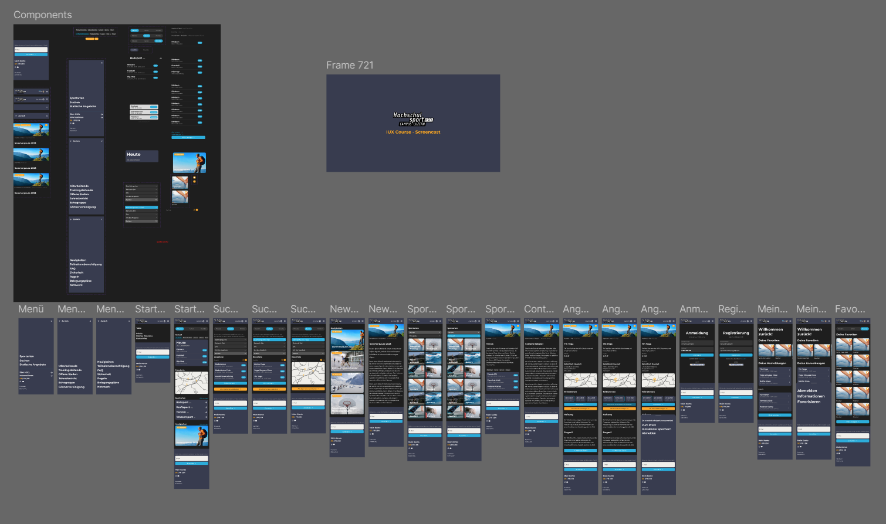

# IUX (User Experience Design & Engineering)
This folder contains all the assets from the IUX module. The project was collaborative and an intensive 9-day sprint. The redesign project focused on improving the usability of the [HSCL](https://www.unilu.ch/campus/sport/) website. Conducted through extensive user research, prototyping, and testing, the project aimed to optimize navigation, structure, and personalization for a better user experience.

## Content
- [General Project](#general-project)
  - [Problem Statement](#problem-statement)
  - [Tested Solutions & Enhancements](#tested-solutions--enhancements)
  - [Project](#project)
  - [Team](#team)

## General Project
* `What is it? -` The goal was to enhance the HSCL website by addressing key usability pain points. Through a structured UX design process, the team defined user needs, created prototypes, and refined them based on extensive user feedback.

### Problem Statement
- Inefficient filtering options
- Confusing registration process
- Lack of a location-based training search
- Content overload and poor structure
- Absence of multilingual support
- Navigation inefficiencies

### Tested Solutions & Enhancements
- New search function with an integrated map view
- Streamlined filtering system, including location-based filtering
- Chronological event listing
- Improved homepage with direct access to key sections
- Clearer naming conventions for better navigation
- Optimized content layout for clarity
- Implementation of a language switcher
- Enhanced training information structure
- Personalized features such as account-based favorites

### Project
* [Figma Prototype](https://www.figma.com/proto/ZQ7E5M9gXRIQyZ30bm113Q/HSCL?page-id=210%3A203&node-id=351-1042&p=f&viewport=151%2C580%2C0.11&t=rBFIgp854gtlzYAE-1&scaling=scale-down&content-scaling=fixed&starting-point-node-id=351%3A1042)
* [Dokumentation](https://yanisdeplazes.github.io/Digital-Ideation/23HS/IUX/Documentation.pdf)
* [Testing & Results](https://yanisdeplazes.github.io/Digital-Ideation/23HS/IUX/Testing_Results.pdf)

[Final Product Screencast (MOV)](./IUX_Screencast.mov)

### Team
- Yanis Deplazes
- Stefan Vögeli
- Jan Schwegler
- Dominika Degtyareva
- Lukas Bucher
- Sebastian Borter
