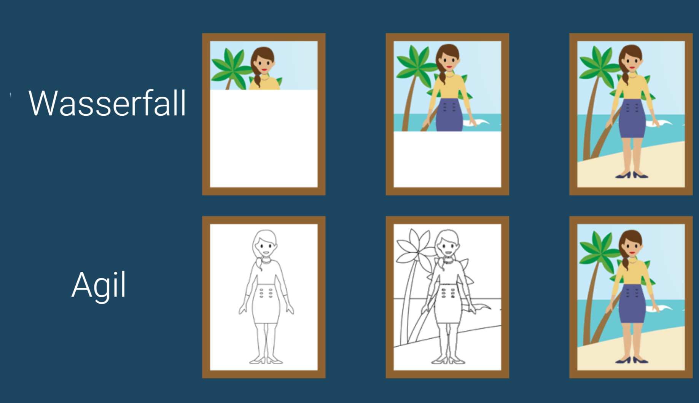
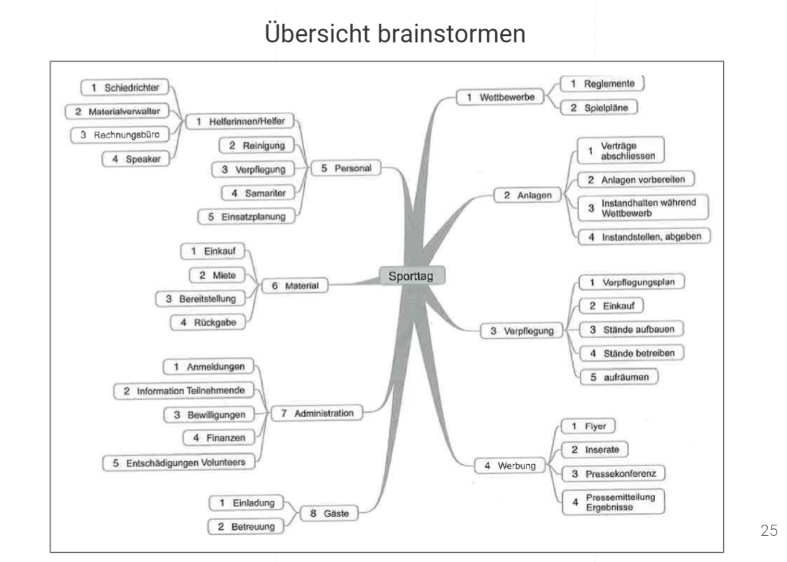
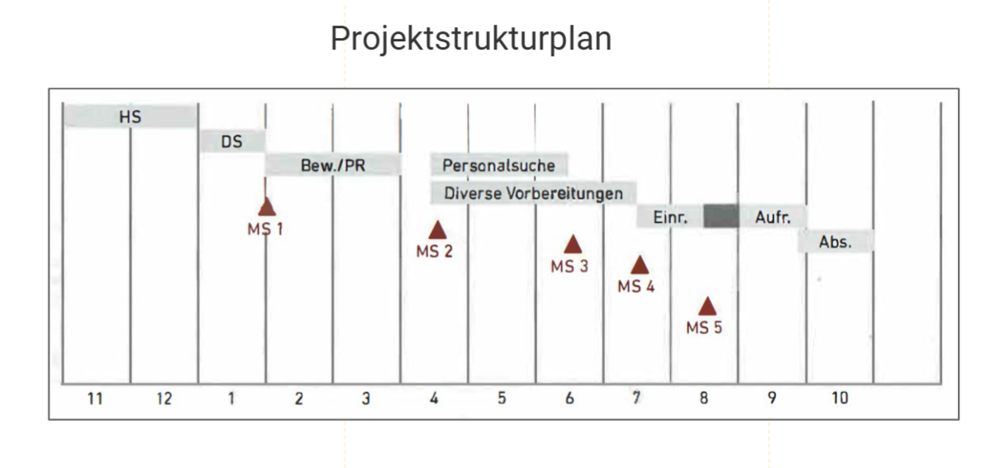
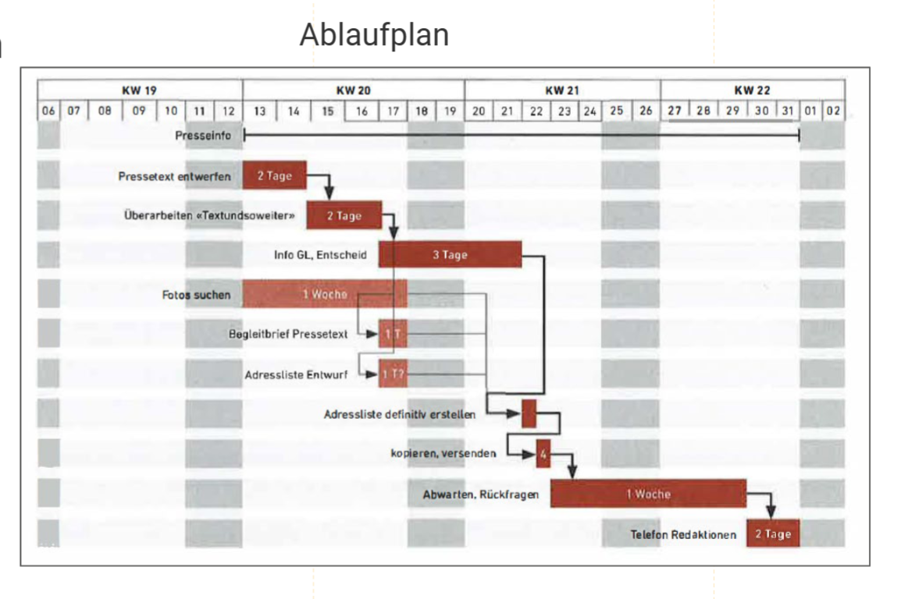
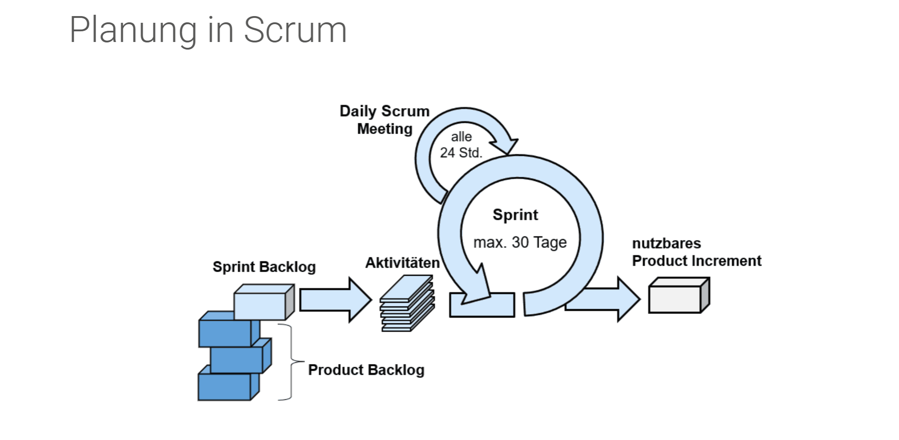
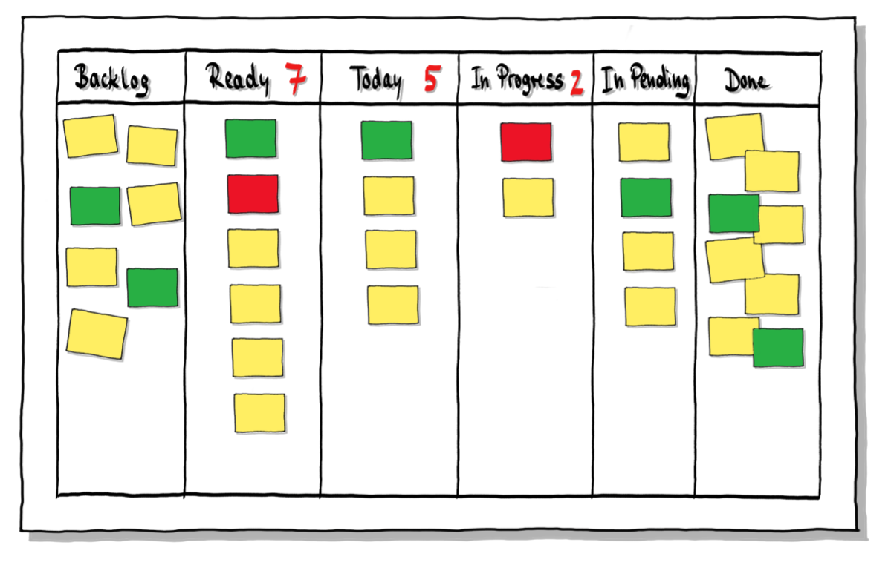
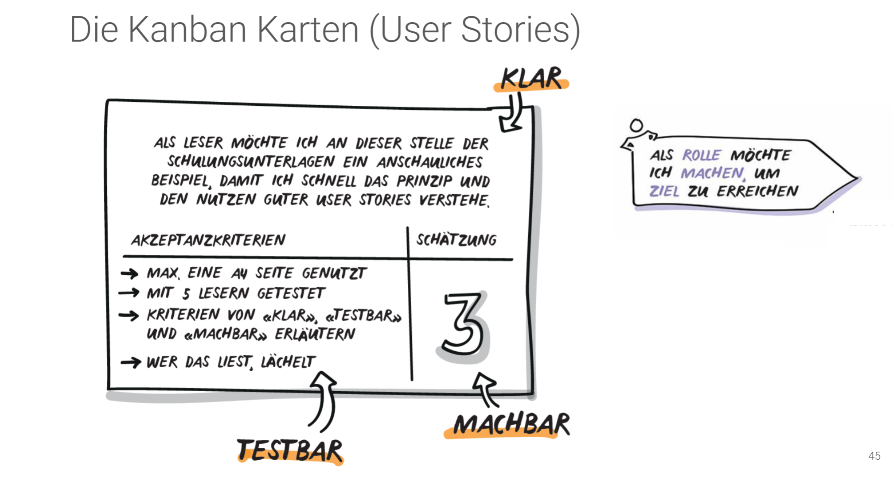
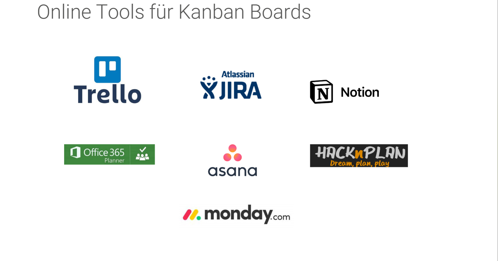

# PROJ (DI Projectmanagement)
This folder contains all the assets from the PROJ module.

## Content
* 

## Klassische und agile Vorgehensweise im Project Management
Ein bewusstes Auswählen der Projekt-Vorgehensweise ist oft bereits der 
entscheidende Punkt für den späteren Erfolg im Projekt.
Entweder du bist agil und hast fast nur Meetings oder du bist klassisch und hast kaum Meetings.

Die Unterschiede zwischen den beiden Vorgehensweisen beschränken sich nur auf zwei Dinge: Genauigkeit und Verantwortlichkeit.

Während im agilen Setup nur wenige Schritte „genau“ geplant werden, versucht die klassische Vorgehensweise vor Beginn der Umsetzung sämtliche zu erledigende Tätigkeiten zu Planen.

Die Planung ist in der klassischen Vorgehensweise 
Aufgabe vom Projektleitenden, im agilen Setup größtenteils vom 
umsetzenden Team.

### Wasserfallmodell vs Agile Vorgehensweise

## Projektplanung
Die ganze Projektplanung besteht aus 4 Hauptphasen:
1. Startphase
2. Planung & Organisation
3. Umsetzung
4. Abschluss

### 1. Startphase
* es entsteht Bedarf für ein Projekt
* Auftragsklärung
* erste Liste von Involvierten (Stakeholder)
* erste Versionen vom Projektplan & Projektrisiken

### 2. Planung & Organisation
*  Projektplanung
* Budgetplanung
* Umsetzungsplanung
* Ressourcenplanung
* Festlegung der Unterstützungssysteme

### 3. Umsetzung
* Umsetzung vom Projekt gemäss der Planung

### 4. Abschluss
* Übergabe an Kunden & Freigaben einholen
* Bewertung der Projektergebnisse
* Teammitglieder werden neuen 
Aufgaben zugewiesen
* Projektevaluation durchführen

## Klassische Projektplanung Deepdive
1. Man erstellt eine Übersicht mit dem gesamten Inhalt des Projektes und auch alle Pesonen, die es braucht als auch die Technik und Tasks

2. Dann legt man diese Elemente auf eine Zeitachse und versieht sie mit Meilensteinen

3. Daraus erstellt man einen detailierten Ablaufplan

## Scrum als agile Vorgehensweise
Das Scrum ist eine iterative und inkrementelle Vorgehensweise im Projektmanagement.Man redet viel miteinander, aber verliert auch etwas Zeit dabei.
Rollen: Product Owner, Scrum Master, Team

## Alternative: Kanban

Das Kanban eignet sich vor allem umd die Arbeit im Team zu visualisieren. Damit kann man Aufgaben klein genug formulieren. Es verhindert auch das mehrfache Erledigen von denselben Arbeiten und gibt dem ganzen Team eine Klarheit und Transparenz über die Aufgaben, die noch anstehen und wo diese Arbeiten momentan noch stehen.

Im Kanban wird die Arbeit nicht zugeteilt, sondern alle im Team “nehmen” sich Arbeitspakete. 

* Alle pendenten Tasks gehören in den Backlog
* Ziel ist es, dass die Tasks möglichst gleichmässig durch das Board fliessen
* Karten werden in den nächsten Arbeitsschritt gezogen (pull), nicht gedrückt (push)

Diese User Stories helfen dabei, die Aufgaben so zu formulieren, dass sie für alle verständlich sind. Das sollte man im Team machen.

## Onlinetools für Planung

## PROJ PDF (Erstellt von einem DI Vorgänger-Jahrgang)
[Allgemeine Zusammenfassung hier öffnen](https://github.com/JustRaika/Digital-Ideation/blob/main/static-wiki/docs/PJM Karten 2025.pdf)
