# STORY (DI Storytelling)
This folder contains all the assets from the STORY module.

## Content
- [Eigenes Projekt](#eigenes-projekt)
- [22.09.2025 - Beispiele und Inspirationen V1](#beispiele-und-inspirationen-v1)
  - [Übung 1 - Webcam Beobachtung](#übung-1---webcam-beobachtung)
- [29.09.2025 - Feedbackrunde zu ersten Ideen der eigenen Arbeit](#feedbackrunde-zu-ersten-ideen-der-eigenen-arbeit)
  - [Übung 2 - Beschreibe einen Ort, den du sehr gut kennst und zeichne ein Bild einer anderen Ortsbeschreibung](#übung-2---beschreibe-einen-ort-den-du-sehr-gut-kennst-und-zeichne-ein-bild-einer-anderen-ortsbeschreibung)
- [06.10.2025 - Beispiele und Inspirationen V2](#beispiele-und-inspirationen-v2)
- [13.10.2025 - Figuren und Szenerien entwickeln](#figuren-und-szenerien-entwickeln)
- [20.10.2025 - Storyworlds](#storyworlds)
- [27.10.2025 - Dialog](#dialog)
- [03.11.2025 - Individuelles Feedback von Susanne zum persönlichen Projekt](#individuelles-feedback-von-susanne-zum-persönlichen-projekt)
- [10.11.2025 - Visual Storytelling & Worldbuilding](#visual-storytelling--worldbuilding)
- [17.11.2025 - Peer Feedback zu eigenen Projekten](#peer-feedback-zu-eigenen-projekten)
- [24.11.2025 - Feedbackrunde zur eigenen Arbeit](#feedbackrunde-zur-eigenen-arbeit)
- [01.12.2025 - Arbeit am Projekt](#arbeit-am-projekt)
- [08.12.2025 - Feiertag, kein Storytelling](#feiertag-kein-storytelling)
- [15.12.2025 - Präsentation der eigenen Arbeit](#präsentation-der-eigenen-arbeit)

### Eigenes Projekt
* `What is it about? -` The Masquerade is an interactive, narrative journey through memory, identity and inner voices.
As a magician and fortune teller, you live among the fates of others – until a mysterious invitation calls you to the Palace of Echoes. At a masked ball that takes place only once a century, you encounter figures who seem strangely familiar: a silent chess player, a dancing priestess and a host wearing a silver fox mask.
Each mask hides more than a face. And the deeper you remember, the closer you come to the question:
_Who were you before the world told you who you should be?_

* [Process Documentation (Miro Board)](https://miro.com/app/board/uXjVJGFK19A=/?share_link_id=924626941800)

* [Play the game here!](https://justraika.itch.io/masquarade)

### 22.09.2025 - Beispiele und Inspirationen V1
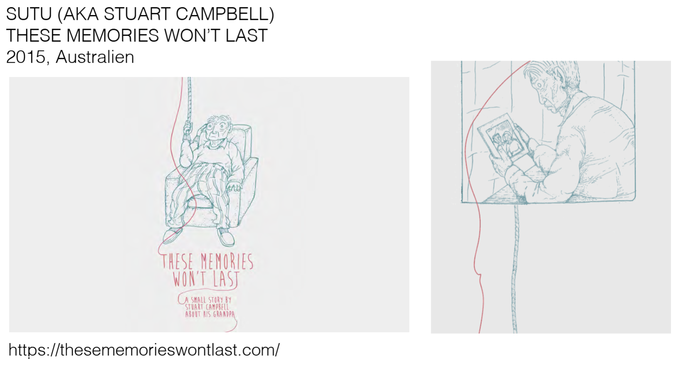
Tolle Web Experience. Es sind zwei verschiedene Scroll Richtungen eingebaut und die Erinnerungen verschinden im Nebel, wenn man versucht zurückzuscrollen. Wie im echten Leben. [Hier geht zur Webseite](https://www.thesememorieswontlast.com/)

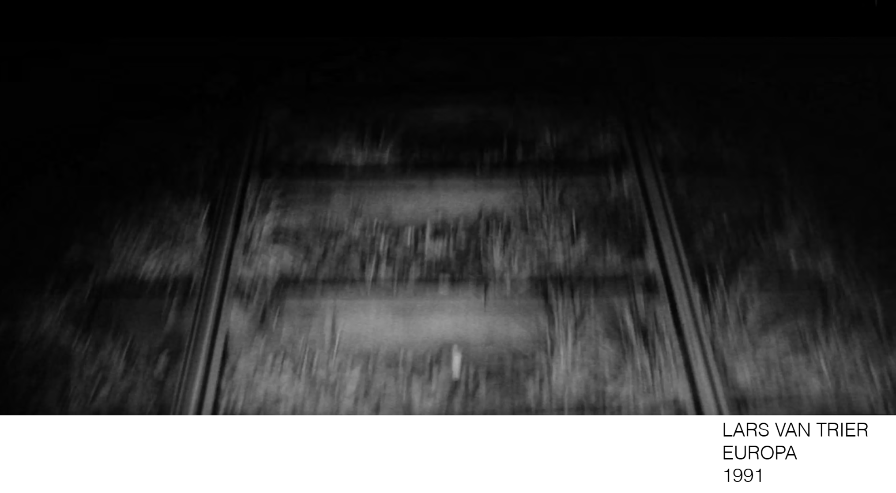
Die Rolle von Audio in Filmen für das Kino. Auf grosser Leinwand in einem dunklen Raum - spannend.

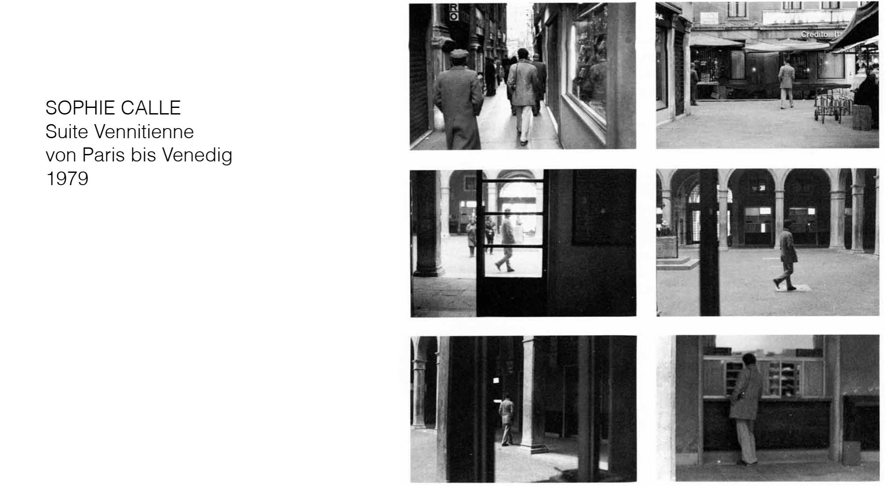
Voyeurismus war schon immer ein Bestand der menschlichen Neugier. Dsa grenzt an dem, was ok ist, aber die Arbeit ist sehr einzigartig. Die Arbeit zeigt Fotos von einem Fremden, der bis nach Venedig "begleitet" wurde.

Hier wurden Gegestände, die von Hotelgästen hinterlassen wurde, fotografiert und zusammengestellt.

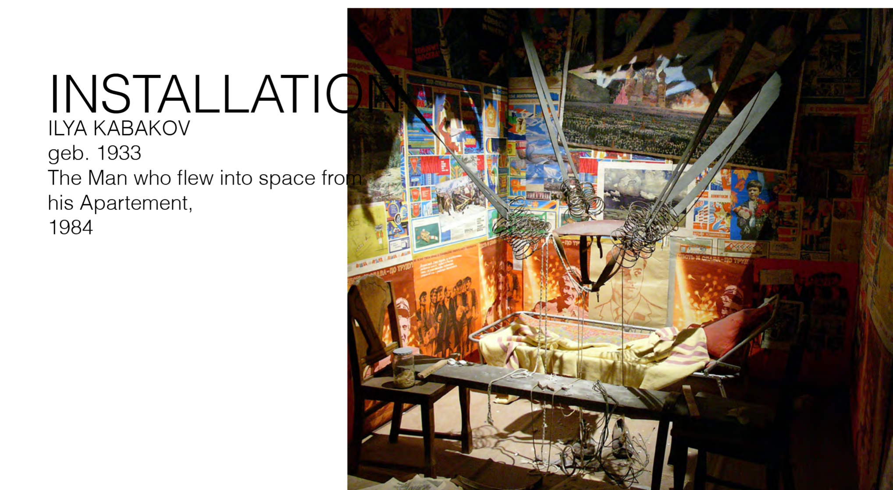
Dieser Künstler aus der Sowjetunion hat die Wohnungen von damals fotografiert.

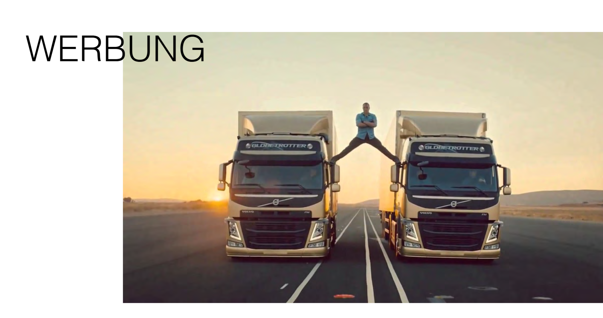
Werbung war schon immer ein Teil von Storytelling.

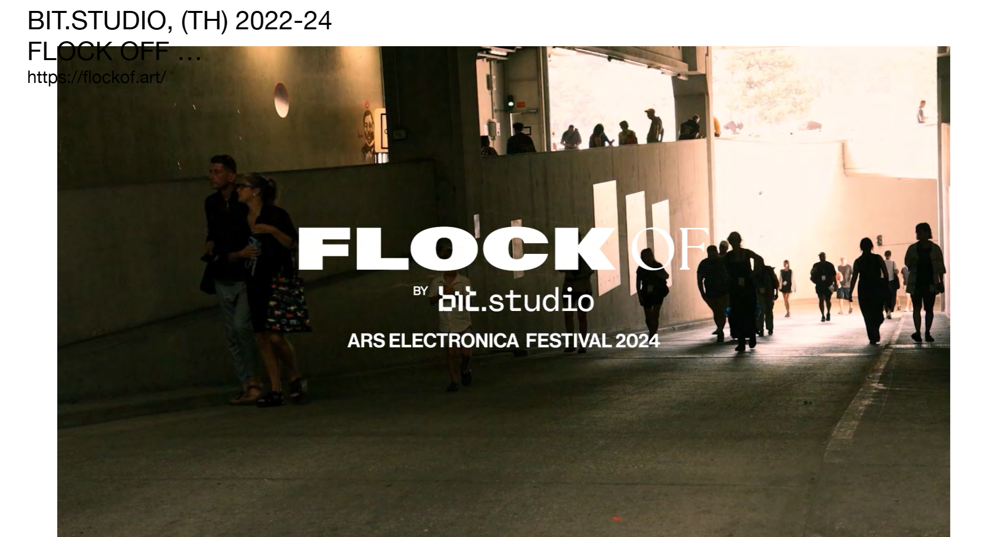
bit.Studio die Installationen nutzt as Storytelling Medium

#### Übung 1 - Webcam Beobachtung
a) Schaue einer Webcam 5 Minuten zu: https://www.in-karystos.gr/timetables-neastryra.html

b) `Wer ist die Hauptfigur?`
Die Hauptfigur ist ein älterer, griechischer Mann, der vom Strandufer in das Meer gewatschelt ist, bis er knietief darin stand und ein Foto mit seiner Handykamera von der Autofähre neben dem Strand machen konnte.

c) `Wie geht es der Hauptfigur im Moment? Wo befindet sie sich? Was denkt die Person gerade, was sieht sie, was riecht sie?` Der Rentner befindet sich bei angenehmen 25° auf einer kleinen, griechischen Insel. Das Meer ist strahlend blau und still. Es riecht nach Salz und der ältere Herr spürt die Sonne auf seiner Haut, die bereits gebräunt ist. Er hört, wie die Autos in die Fähre einfahren und verfrachtet werden.

d) `Welche Probleme hat deine Hauptfigur? Wen hasst sie, wen liebt sie? Was kann sie gar nicht? Was ist ihr grösster Fehler?` Der alte Herr hasst die junge Generation, die am Strand sonnt und laute Musik hört. Deswegen geht er nur tagsüber ans Meer. Er hat kaum Geld und kann sich nicht leisten, die Insel zu verlassen. Deshalb ist seine Haut so gebräunt und dem Krebsrisiko der Sonnenstrahlen ausgesetzt. Leider kann der Renter auch nicht mehr schwimmen, weil er einen dicken Bauch hat.  

e) `Was ist gut an der Hauptfigur? Was gefällt ihr an sich am besten? Was magst du an ihr? Was ist ihre schönste Eienschaft?` Der Renter hat alles gesehen im Leben. Und das weiss er auch. Er geniesst das Leben im vollen Zügen - ganz nach dem Motto: "Momento Mori". Er schätzt seine Frau und seine Freunde als auch seine Erfahrungen und weiss, dass er nirgends mehr hin muss im Leben. 

f) `Beschreibe die Welt in der deine Hauptfigur lebt. Wie ist das politische System? Wer oder was regiert? Wie sieht es dort aus und wie bewegt sich deine Figur durch diese Welt?` In dieser Welt regiert alles, was viel Geld hat. Das Land ist durch Geldsorgen getrieben. Wer Geld hat, hat Macht. Es herrscht zwar Demokratie, aber die ist nur scheinheilig.

### 29.09.2025 - Feedbackrunde zu ersten Ideen der eigenen Arbeit
Heute hatten wir ein Ideen-Speeddating um Personen zu finden, die zu unseren Konzepten passen. Manche Personen arbeiten auch alleine, weil sie an persönlichen Projekten arbeiten, wie z.B die Geschichte ihrer Grossmutter oder persönliche Erfahrungen zu Isolation. 

Webseite, die gut Daten visualisert aber trotzdem ein gutes UX und Storytelling hat. [Hier geht zur Seite](https://thepudding.co/)

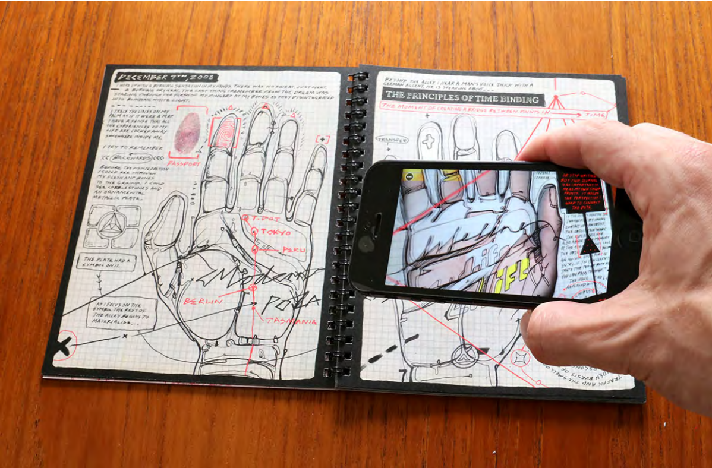
Eine Geschichte mit Zeichnungen, die mit einer kamera gescann werden kann und dann in AR erlebt werden kann.
[Hier geht es zur Demo](https://modernpolaxis.com/index.html)

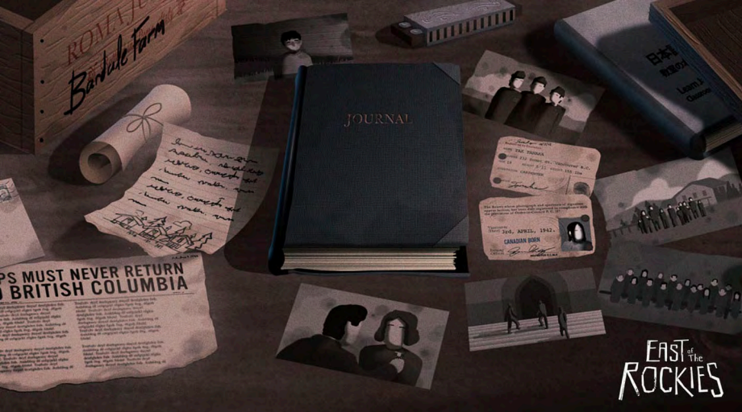
An interactive app retelling of acclaimed author Joy Kogawa’s story about Japanese internment in WWII.

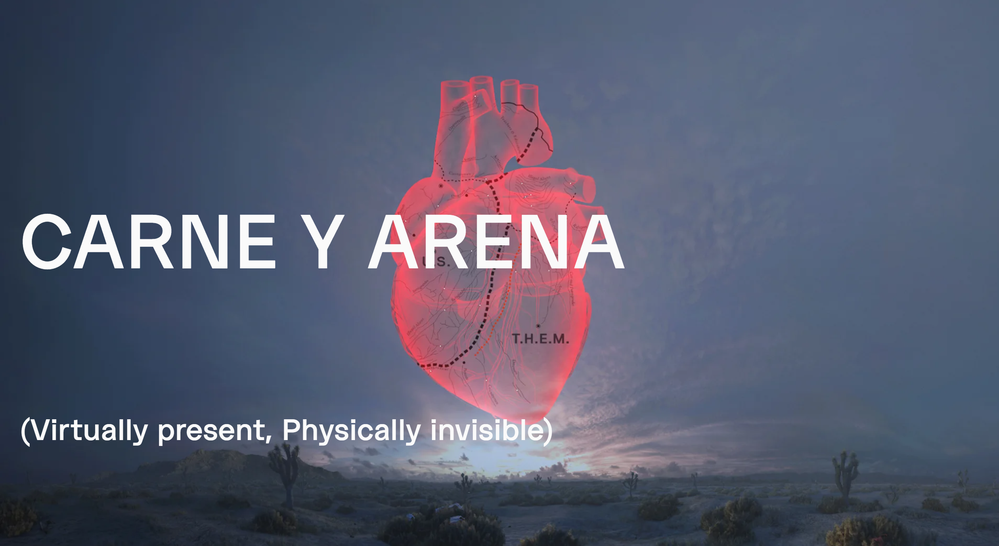

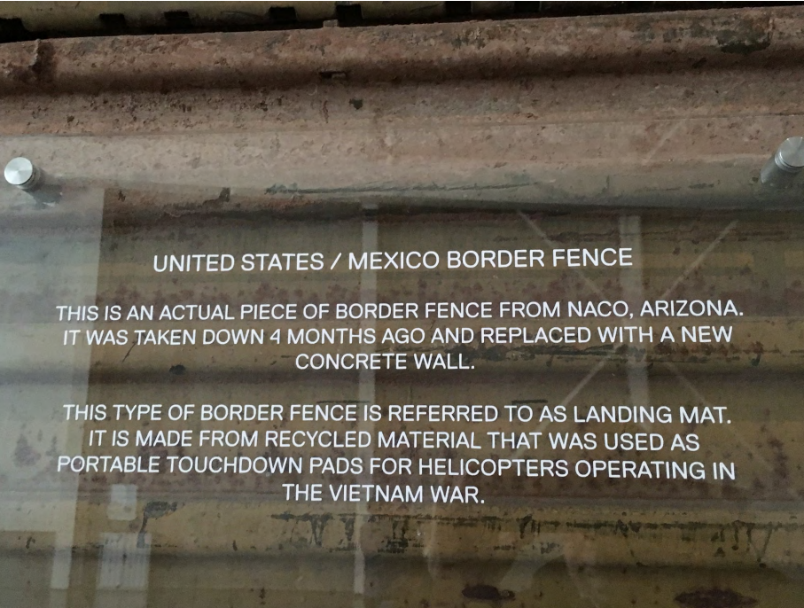

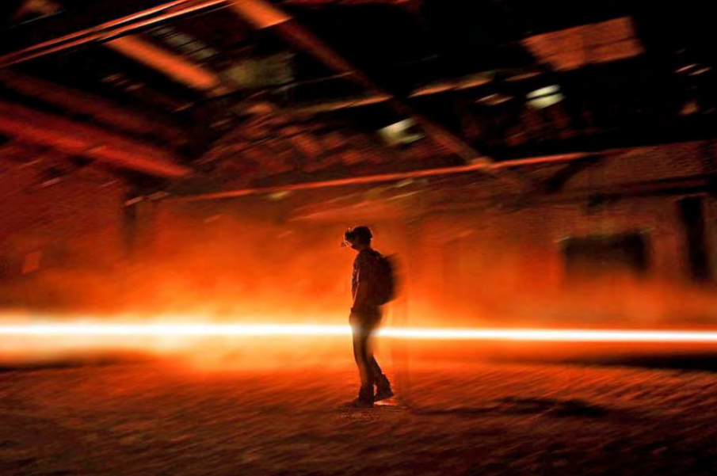

This immersive experience explores the human condition of immigrants and refugees.
[Mehr Bilder und Infos hier](https://phi.ca/en/carne-y-arena/)

#### Übung 2 - Beschreibe einen Ort, den du sehr gut kennst und zeichne ein Bild einer anderen Ortsbeschreibung 
a) Draussen hängt der Mond bereits hoch am Himmel, drinnen liegen die Räume in gedämpftem Licht. Ab und zu klirrt noch irgendwo eine Gewichtsscheibe an eine Andere, doch meistens ist das Gym um diese Uhrzeit schon verlassen. Einzig die Playlist läuft lautstark im Loop und untermalt die Szenarie mit schlechtem Soundtrack über die Stille – der perfekte Zeitpunkt, die Welt draussen einmal auf Pause zu setzen und sich auf den eigenen Atem und die eigenen Bewegungen zu fokussieren.
Die Maschinen stehen still, nur manchmal läuft eine ältere Person auf dem Laufband und sammelt ihre Schritte. 
Und wenn man durch den Raum geht, erzählen allein die offenen Garderobenschränke von dem, was hier vor ein paar Stunden noch voller Leben war.

b) Zeichne eine andere Ortbeschreibung.

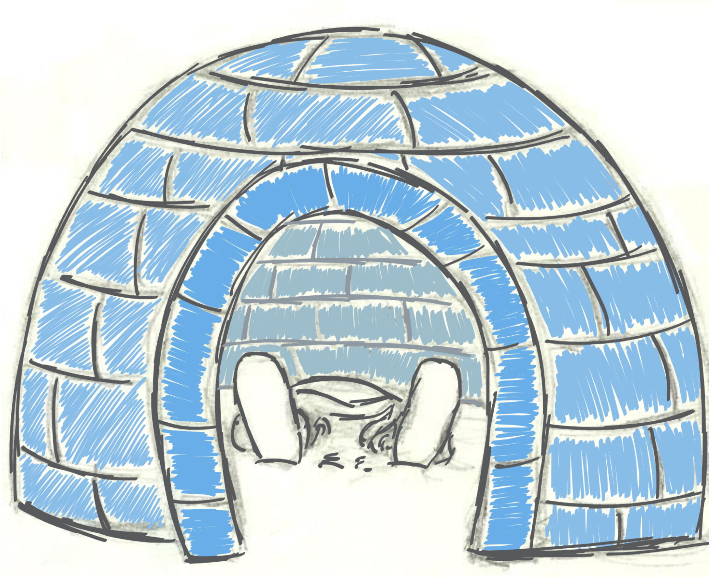

c) Nun versuche aufgrund eines Ortes eine Geschichte zu erzählen. Ausgangsbild:

Ich stehe in einer Höhle. Vor mir ziehen sich feste Wurzeln um den Eingang, darüber hängt ein Blätterdach. In der Ferne zieht sich ein weite Wiese hin. Es ist still. Nur das Zwitschern der Vögel und das Rascheln der Blätter sind zu hören. Ich atme tief ein und aus.

### 06.10.2025 - Beispiele und Inspirationen V2
Geschichten leben von Emotionen. Wenn wir bspw. Titanic anschauen, dann schauen wir nicht, weil wir in erster Linie den Schiffsuntergang sehen wollen, sondern weil wir die Emotionen sehen wollen. 

Auch die Identifikation mit Protagonisten ist wichtig. Wenn wir uns mit den Charakteren identifizieren, können wir ihre Emotionen und Erfahrungen besser nachvollziehen und erleben.

Wo ist der emotionale Kern der Geschichte? So kommt man zum Kern. Das nennt sich `Prämise`. 

Oft haben Geschichten auch Antagonisten. Diese sind nicht immer böse, sondern können auch einfach Gegenspieler sein, die den Protagonisten herausfordern. Sie wollen meistens das Gegenteil von dem, was der Protagonist will.

### 13.10.2025 - Figuren und Szenerien entwickeln
### 20.10.2025 - Storyworlds
Übung draussen.
### 27.10.2025 - Dialog
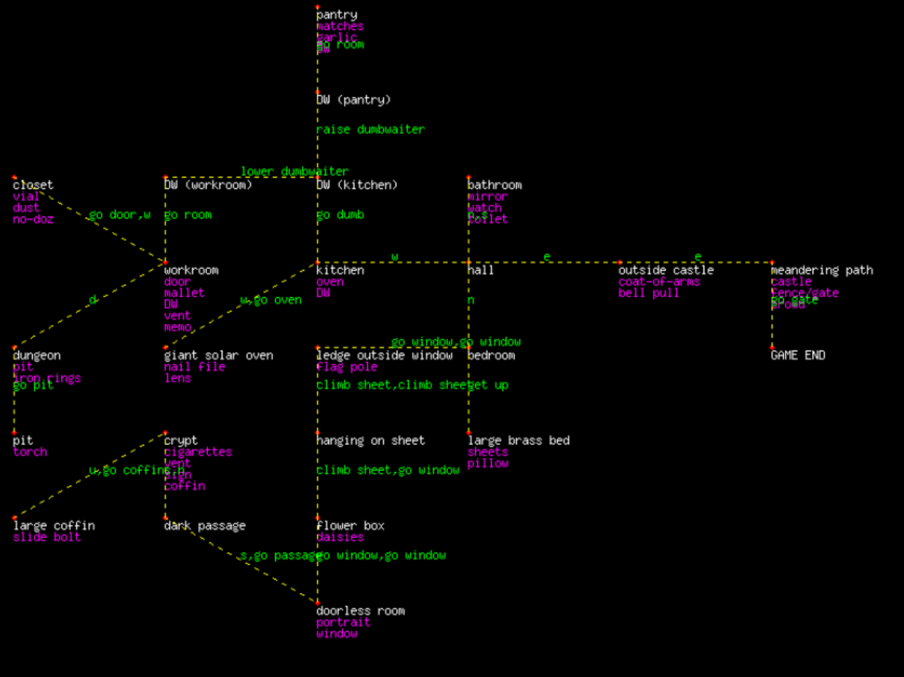
Wie Storytelling Vorbereitung in einem Videogame ausschauen kann. 

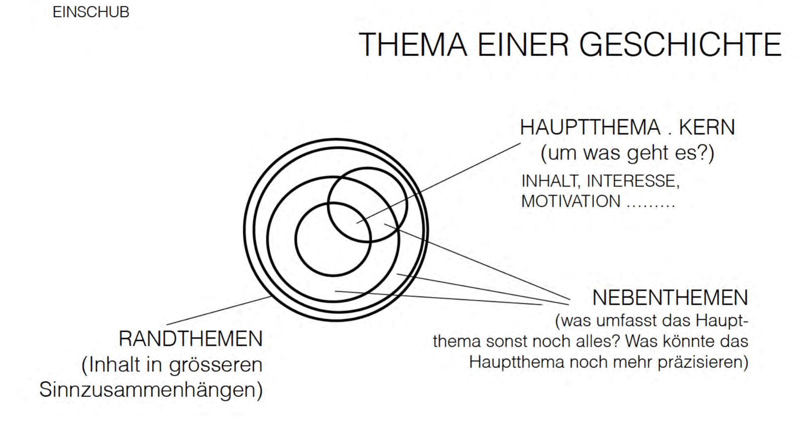
Eine Geschichte kann man sich als Kreis vorstellen mit mehreren kleinen Kreisen darin. 

Story vs Plot: Story ist eine chronologische Serie von Handlungen, die andere bedingen. Plot ist die Ordnung der Handlungen, wie sie uns erzählt werden.

Es gibt diverse Erzählstrukturen, z.B die klassische lineare Erzählstruktur, Hypertext, konzentrische Erzählstruktur, elastische Erzählstruktur, parallele Erzählstruktur, verzweigte Erzählstruktur. 

### 03.11.2025 - Individuelles Feedback von Susanne zum persönlichen Projekt
Takeaways: Ein anderes Medium überlegen - vielleicht ein Dialog für ein Game? Auch überlegen, was ich genau spannend finde an der Serie "The Power", weshalb ich darüber schreiben möchte. Auch anschauen: Show "Lovescammers" auf Netflix.
### 10.11.2025 - Visual Storytelling & Worldbuilding
### 17.11.2025 - Peer Feedback zu eigenen Projekten
### 24.11.2025 - Feedbackrunde zur eigenen Arbeit
### 01.12.2025 - Arbeit am Projekt
### 08.12.2025 - Feiertag, kein Storytelling
### 15.12.2025 - Präsentation der eigenen Arbeit

Feedback von der Klasse: 
- "Dynamisches Storytelling, einheitliche Farben, sieht spannend aus" -Janina
- "Ich mag solche Elemente, wie dass man auswählen kann welche Karte man umdrehen möchte, solche Details ziehen mich in die Geschichte rein und davon dürfte es gerne mehr haben." -Matti
- "Sehr stimmungsvoll erzählt, man möchte mehr wissen.
Du hast mich gleich mitgenommen in die Geschichte.
Interessant zu überlegen, wie das interaktive Geschichtenerzählen." -Susanne
-"Die Atmosphäre gefällt mir sehr gut, und ich finde es spannend, dass man innerhalb der Story auch selbst Entscheidungen treffen kann. Mir ist aufgefallen ist, dass der Text teilweise über Bildelementen stand, die ich eigentlich hätte sehen wollen (z.B. bei der Fuchsmaske)." -Milena
- "Finde die einzelnen Interaktionen machen die Geschichte lebendig. Ich bin dabei aber sehr Fan von verschiedenen Enden (verstehe, dass das viel mehr Aufwand ist). Hatte aber noch die Frage, ob die Tarot-Karten randomized sind?" -Lendi

Weitere Präsentation, die ich sehr gelungen und spannend fand, das Konzept zu Umsetzung als auch das Worldbuiling. 

* [Fortune ails you by Tamara Faoro](https://github.com/JustRaika/Digital-Ideation/blob/main/static-wiki/docs/fortune-ails-you_präsi.pdf)
* [Fortune ails you Miro Board](https://github.com/JustRaika/Digital-Ideation/blob/main/static-wiki/docs/fortune-ails-you_story.pdf)

g