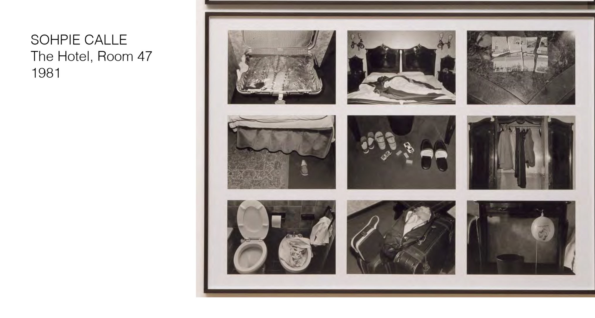

# STORY (DI Storytelling)
This folder contains all the assets from the STORY module.

## Content
- [22.09.2025 - Beispiele und Inspirationen V1](#beispiele-und-inspirationen-v1)
  - [Übung 1 - Webcam Beobachtung](#übung-1---webcam-beobachtung)
- [29.09.2025 - Feedbackrunde zu ersten Ideen der eigenen Arbeit](#feedbackrunde-zu-ersten-ideen-der-eigenen-arbeit)
- [06.10.2025 - Beispiele und Inspirationen V2](#beispiele-und-inspirationen-v2)
- [13.10.2025 - Figuren und Szenerien entwickeln](#figuren-und-szenerien-entwickeln)
- [20.10.2025 - Storyworlds](#storyworlds)
- [27.10.2025 - Dialog](#dialog)
- [03.11.2025 - Non-Lineares Erzählen](#non-lineares-erzählen)
- [10.11.2025 - Visual Storytelling](#visual-storytelling)
- [17.11.2025 - Sound](#sound)
- [24.11.2025 - Feedbackrunde zur eigenen Arbeit](#feedbackrunde-zur-eigenen-arbeit)
- [01.12.2025 - Arbeit am Projekt](#arbeit-am-projekt)
- [08.12.2025 - Gemeinsam einen Film schauen und besprechen](#gemeinsam-einen-film-schauen-und-besprechen)
- [15.12.2025 - Präsentation der eigenen Arbeit](#präsentation-der-eigenen-arbeit)

### 22.09.2025 - Beispiele und Inspirationen V1

Tolle Web Experience. Es sind zwei verschiedene Scroll Richtungen eingebaut und die Erinnerungen verschinden im Nebel, wenn man versucht zurückzuscrollen. Wie im echten Leben. [Hier geht zur Webseite](https://www.thesememorieswontlast.com/)

Die Rolle von Audio in Filmen für das Kino. Auf grosser Leinwand in einem dunklen Raum - spannend.

Voyeurismus war schon immer ein Bestand der menschlichen Neugier. Dsa grenzt an dem, was ok ist, aber die Arbeit ist sehr einzigartig. Die Arbeit zeigt Fotos von einem Fremden, der bis nach Venedig "begleitet" wurde.

Hier wurden Gegestände, die von Hotelgästen hinterlassen wurde, fotografiert und zusammengestellt.

Dieser Künstler aus der Sowjetunion hat die Wohnungen von damals fotografiert.

Werbung war schon immer ein Teil von Storytelling.

bit.Studio die Installationen nutzt as Storytelling Medium

#### Übung 1 - Webcam Beobachtung
a) Schaue einer Webcam 5 Minuten zu: https://www.in-karystos.gr/timetables-neastryra.html

b) `Wer ist die Hauptfigur?`
Die Hauptfigur ist ein älterer, griechischer Mann, der vom Strandufer in das Meer gewatschelt ist, bis er knietief darin stand und ein Foto mit seiner Handykamera von der Autofähre neben dem Strand machen konnte.

c) `Wie geht es der Hauptfigur im Moment? Wo befindet sie sich? Was denkt die Person gerade, was sieht sie, was riecht sie?` Der Rentner befindet sich bei angenehmen 25° auf einer kleinen, griechischen Insel. Das Meer ist strahlend blau und still. Es riecht nach Salz und der ältere Herr spürt die Sonne auf seiner Haut, die bereits gebräunt ist. Er hört, wie die Autos in die Fähre einfahren und verfrachtet werden.

d) `Welche Probleme hat deine Hauptfigur? Wen hasst sie, wen liebt sie? Was kann sie gar nicht? Was ist ihr grösster Fehler?` Der alte Herr hasst die junge Generation, die am Strand sonnt und laute Musik hört. Deswegen geht er nur tagsüber ans Meer. Er hat kaum Geld und kann sich nicht leisten, die Insel zu verlassen. Deshalb ist seine Haut so gebräunt und dem Krebsrisiko der Sonnenstrahlen ausgesetzt. Leider kann der Renter auch nicht mehr schwimmen, weil er einen dicken Bauch hat.  

e) `Was ist gut an der Hauptfigur? Was gefällt ihr an sich am besten? Was magst du an ihr? Was ist ihre schönste Eienschaft?` Der Renter hat alles gesehen im Leben. Und das weiss er auch. Er geniesst das Leben im vollen Zügen - ganz nach dem Motto: "Momento Mori". Er schätzt seine Frau und seine Freunde als auch seine Erfahrungen und weiss, dass er nirgends mehr hin muss im Leben. 

f) `Beschreibe die Welt in der deine Hauptfigur lebt. Wie ist das politische System? Wer oder was regiert? Wie sieht es dort aus und wie bewegt sich deine Figur durch diese Welt?` In dieser Welt regiert alles, was viel Geld hat. Das Land ist durch Geldsorgen getrieben. Wer Geld hat, hat Macht. Es herrscht zwar Demokratie, aber die ist nur scheinheilig.

### 29.09.2025 - Feedbackrunde zu ersten Ideen der eigenen Arbeit
Heute hatten wir ein Ideen-Speeddating um Personen zu finden, die zu unseren Konzepten passen. Manche Personen arbeiten auch alleine, weil sie an persönlichen Projekten arbeiten, wie z.B die Geschichte ihrer Grossmutter oder persönliche Erfahrungen zu Isolation. 

* Webseite, die gut Daten visualisert aber trotzdem ein gutes UX und Storytelling hat. [Hier geht zur Seite](https://thepudding.co/)

### 06.10.2025 - Beispiele und Inspirationen V2
### 13.10.2025 - Figuren und Szenerien entwickeln
### 20.10.2025 - Storyworlds
### 27.10.2025 - Dialog
### 03.11.2025 - Non-Lineares Erzählen 
### 10.11.2025 - Visual Storytelling
### 17.11.2025 - Sound
### 24.11.2025 - Feedbackrunde zur eigenen Arbeit
### 01.12.2025 - Arbeit am Projekt
### 08.12.2025 - Gemeinsam einen Film schauen und besprechen
### 15.12.2025 - Präsentation der eigenen Arbeit
